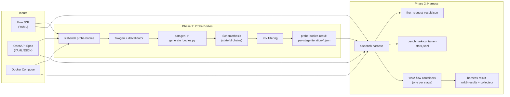
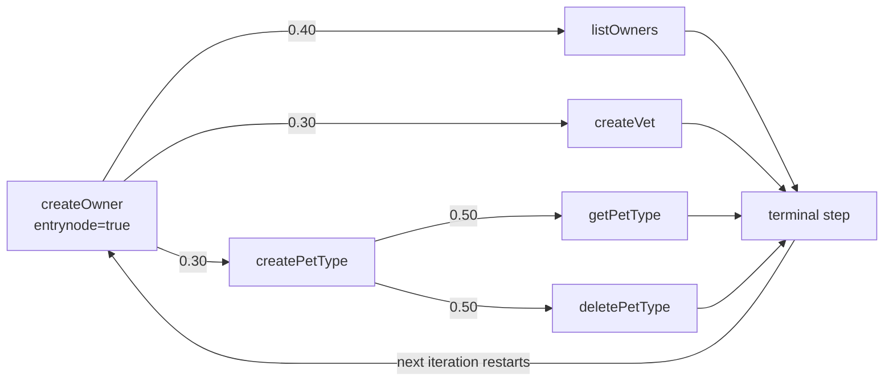
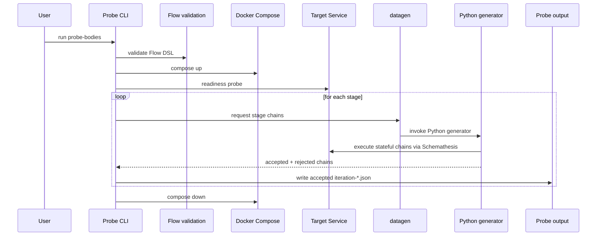
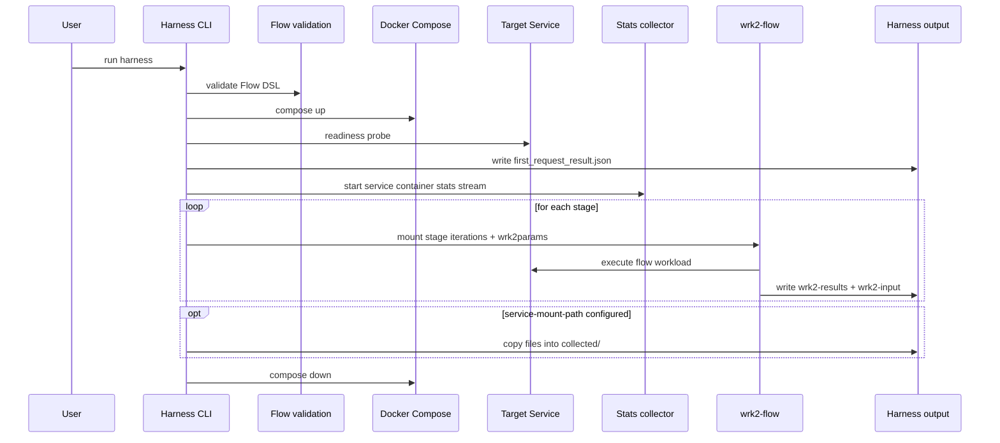
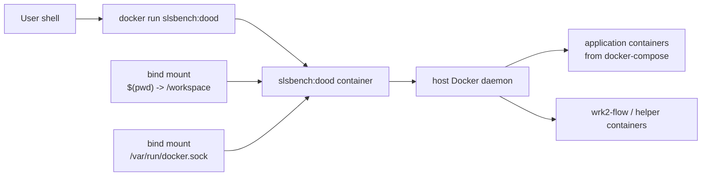
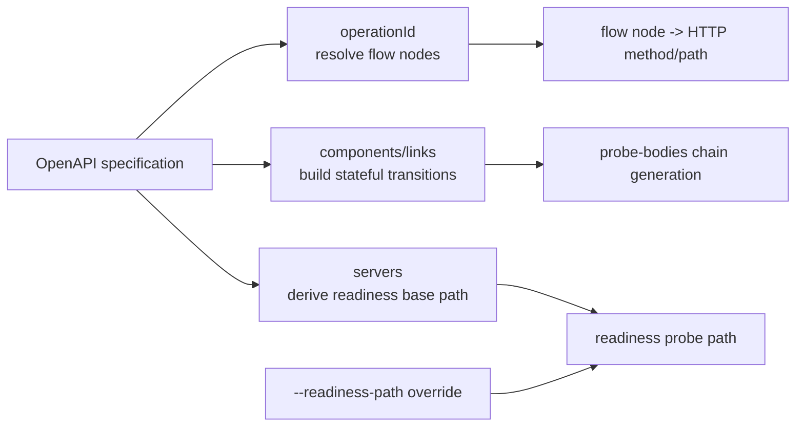

# slsbench — Serverless Benchmark Suite

A scenario-based benchmarking framework for serverless and containerized applications. Instead of reducing an application to isolated endpoint probes or a single aggregate latency number, `slsbench` derives stateful, link-aware API request chains from **OpenAPI specifications** and executes them through a **flow DSL** that models realistic usage patterns. The intent is to benchmark how applications are used in practice: multi-step CRUD behavior, weighted branching, reusable scenario instances, and phase-aware execution under configurable [wrk2](https://github.com/giltene/wrk2) load.

## Architecture



**Phase 1 — `probe-bodies`**: Starts the application via Docker Compose, validates the Flow DSL, delegates stateful chain generation to `generate_bodies.py` through `datagen`, executes chains using [Schemathesis](https://schemathesis.readthedocs.io/) (respecting OpenAPI Links), and persists only 2xx-accepted iterations.

**Phase 2 — `harness`**: Starts the application, measures time-to-first-response, streams container stats for the benchmarked service, then runs one `wrk2-flow` container per flow stage using the pre-generated iterations. Collects latency histograms, throughput data, and optional copied artifacts from the service container.

## Why This Matters

`slsbench` is designed for evaluations where realistic usage structure matters as much as raw request rate. Traditional microbenchmark-style load tests are useful for aggregate throughput and latency, but they flatten away how an application behaves across dependent operations, branching flows, cold start, and steady state.

The two-phase design addresses that gap. `probe-bodies` separates scenario validity from measurement by materializing reusable `iteration-*.json` chains that already reflect valid state transitions. `harness` then replays those validated chains under controlled load, while also recording first-response timing and container-level resource stats. This gives a stronger basis for comparing frameworks and runtime configurations because the benchmark is driven by realistic scenario instances rather than ad hoc request scripts.

## Prerequisites

| Dependency | Version | Notes |
|---|---|---|
| **Go** | 1.24+ | [Install Go](https://go.dev/doc/install) |
| **Docker** | 20.10+ | With Docker Compose v2 (`docker compose`) |
| **Docker Compose** | v2 | Usually bundled with Docker Desktop |

When running via the Docker image (recommended), Go and Python are not needed on the host.

## Installation

### Option 1: Build from Source

```bash
git clone <repository-url>
cd serverless-benchmarking
```

Using the build script (checks all prerequisites automatically):

```bash
./build.sh
```

Or manually:

```bash
go build -o slsbench ./cmd/slsbench
```

Then optionally move the binary into your `PATH`:

```bash
sudo mv slsbench /usr/local/bin/
```

### Option 2: Docker Image (Recommended for DooD)

```bash
docker build -t slsbench:dood .
```

The image bundles Go-built `slsbench`, Python 3.12 with Schemathesis, and all required scripts. Use it with Docker-out-of-Docker by mounting the host Docker socket.

### Verify Installation

```bash
slsbench help
```

## Quick Start

The benchmarking workflow is two steps: generate probe bodies, then run the harness.

```bash
# Step 1: Generate stateful probe bodies
slsbench probe-bodies \
  --flow-path ./flow.yaml \
  --openapi-link ./openapi.yml \
  --output-path ./probe-output \
  --docker-compose-path ./docker-compose.yml \
  --service-name petclinic \
  --port 9966

# Step 2: Run the benchmark harness
slsbench harness \
  --flow-path ./flow.yaml \
  --probe-bodies-path ./probe-output/probe-bodies-result-<timestamp> \
  --openapi-spec-path ./openapi.yml \
  --docker-compose-path ./docker-compose.yml \
  --service-name petclinic \
  --port 9966 \
  --result-path ./results
```

An example application setup (flow DSL, OpenAPI spec, Docker Compose) can be found in the companion evaluation harness repository.

## Flow DSL Reference

Benchmark scenarios are defined in a YAML file validated against a [JSON Schema](internal/service/dslvalidator/schema/dsl.schema.json). The top-level key is `stages`, where each stage combines two things: a load profile (`wrk2params`) and a directed usage model (`flow`). In other words, the Flow DSL is not just an input format. It is the structured representation of application behavior that turns specification-level API operations into an executable workload scenario.

### Schema

```yaml
stages:
  <stage-name>:
    wrk2params: "<wrk2 CLI flags>"   # e.g. "-t2 -c5 -d30s -R500"
    flow:
      - <node-name>:
          operationId: <string>      # OpenAPI operationId (required)
          entrynode: true            # marks the flow entry point (one per stage)
          edges:
            - to: <target-node>      # name of another node in this stage
              weight: <0.0-1.0>      # relative probability of this transition
              mappings:              # optional field mappings between steps
                - source: "body.id"
                  destination: "path.ownerId"
```

### Fields

| Field | Type | Required | Description |
|---|---|---|---|
| `stages` | object | yes | Map of stage names to stage definitions |
| `wrk2params` | string | yes | wrk2 CLI parameters (threads, connections, duration, rate) |
| `flow` | array | yes | Ordered list of flow nodes |
| `operationId` | string | yes | OpenAPI `operationId` — resolved to HTTP method and path at runtime |
| `entrynode` | boolean | no | Marks the starting node of the flow graph |
| `edges` | array | no | Outgoing transitions from this node |
| `edges[].to` | string | yes | Target node name |
| `edges[].weight` | number | no | Relative transition probability (weights are normalized per node) |
| `edges[].mappings` | array | no | Field mappings from source response to destination request |

### Example

```yaml
stages:
  mixed:
    wrk2params: -t2 -c10 -d60s -R500
    flow:
      - createOwner:
          operationId: addOwner
          entrynode: true
          edges:
            - to: createPetType
              weight: 0.30
            - to: listOwners
              weight: 0.40
            - to: createVet
              weight: 0.30

      - createPetType:
          operationId: addPetType
          edges:
            - to: getPetType
              weight: 0.50
            - to: deletePetType
              weight: 0.50

      - listOwners:
          operationId: listOwners

      - createVet:
          operationId: addVet

      - getPetType:
          operationId: getPetType

      - deletePetType:
          operationId: deletePetType
```

The flow graph supports weighted round-robin (WRR) transitions. Leaf nodes (no edges) are terminal — the iteration ends there and a new one starts from the entry node.



This graph is the runtime meaning of the YAML: one node is the entry point, outgoing edges are weighted, terminal nodes end the current iteration, and the next iteration starts again from the entry node. That makes the Flow DSL a compact way to express scenario shape: where a user journey begins, how it branches, which operations are likely to dominate, and how request-rate settings should be applied during replay.

## Command Reference

### `slsbench probe-bodies`

Generates stateful, link-aware API chains using Schemathesis against a running application and persists accepted chain artifacts for use by the harness. Methodologically, this is the phase that materializes realistic scenario instances before any performance measurement is interpreted.

**What it does:**

1. Starts the application via Docker Compose
2. Waits for the service to become ready (readiness probe derived from OpenAPI or `--readiness-path`)
3. For each flow stage, generates stateful API chains via Schemathesis, filtering for 2xx-accepted responses
4. Writes accepted iterations as `iteration-*.json` files under `<output-path>/probe-bodies-result-<timestamp>/<stage>/`
5. Tears down Docker Compose resources



`probe-bodies` is stage-oriented rather than endpoint-oriented. The Go service validates the flow, then hands chain generation to `scripts/generate_bodies.py` through `datagen`, which uses Schemathesis and OpenAPI Links to build valid stateful chains. Only accepted 2xx chains are persisted because the goal is to benchmark scenario execution, not repeatedly rediscover invalid payloads or broken state transitions during later load tests.

**Flags:**

| Flag | Short | Default | Required | Description |
|---|---|---|---|---|
| `--flow-path` | `-f` | — | yes | Path to the flow DSL YAML file |
| `--openapi-link` | `-o` | — | yes | OpenAPI file path or URL |
| `--output-path` | `-r` | `./result-probe` | yes | Output directory for accepted probe bodies |
| `--docker-compose-path` | `-d` | — | yes | Path to docker-compose.yml for the application |
| `--service-name` | `-n` | — | yes | Service name in docker-compose to probe |
| `--port` | `-p` | `8080` | yes | Service port inside the Docker network |
| `--docker-socket-path` | — | `/var/run/docker.sock` | no | Docker socket path (for DooD mode) |
| `--readiness-path` | — | `""` | no | Explicit HTTP readiness probe path (auto-derived from OpenAPI if empty) |
| `--max-probe-target` | — | `0` | no | Cap the number of generated iterations per stage (`0` = unlimited) |
| `--no-rewrite-linked-values` | — | `false` | no | Disable replacing linked values with JSON pointers in output |
| `--debug` | — | `false` | no | Enable detailed probe debug logs |

**Example:**

```bash
slsbench probe-bodies \
  -f ./flow.yaml \
  -o ./openapi.yml \
  -r ./probe-output \
  -d ./docker-compose.yml \
  -n petclinic \
  -p 9966 \
  --max-probe-target 500
```

### `slsbench harness`

Orchestrates benchmark execution using flow stages, pre-generated probe-bodies iterations, Docker Compose, and `wrk2-flow` containers. This is the execution phase: it replays already-validated scenarios under controlled load so that the resulting measurements can be interpreted as performance evidence rather than scenario-generation noise.

**What it does:**

1. Starts the service with Docker Compose
2. Measures time to first successful response and writes `first_request_result.json`
3. For each flow stage, runs one dedicated `wrk2-flow` container with the stage's probe data and wrk2 parameters
4. Collects container resource stats (CPU, memory, network I/O) throughout the run
5. Optionally copies mounted paths from the service container to results
6. Tears down Docker Compose resources



Unlike `probe-bodies`, `harness` consumes previously generated iterations as input. It adds first-response measurement for cold-start-oriented analysis, service container stats for resource interpretation, per-stage `wrk2-flow` execution for sustained-load behavior, and optional artifact collection in a single benchmark run.

**Flags:**

| Flag | Short | Default | Required | Description |
|---|---|---|---|---|
| `--flow-path` | `-f` | — | yes | Path to the flow DSL YAML file |
| `--probe-bodies-path` | `-b` | — | yes | Path to probe-bodies result root (contains `<stage>/iteration-*.json`) |
| `--openapi-spec-path` | `-o` | — | yes | Path to the OpenAPI spec file |
| `--docker-compose-path` | `-d` | — | yes | Path to docker-compose.yml for the application |
| `--service-name` | `-n` | — | yes | Service name in docker-compose to benchmark |
| `--port` | `-p` | `8080` | no | Service port inside the Docker network |
| `--result-path` | `-r` | `./result` | no | Base output path (a timestamped run directory is created inside) |
| `--service-mount-path` | `-m` | `[]` | no | Paths inside service container to copy to results (repeatable) |
| `--docker-socket-path` | — | `/var/run/docker.sock` | no | Docker socket path (for DooD mode) |
| `--readiness-path` | — | `""` | no | Explicit HTTP readiness probe path (auto-derived from OpenAPI if empty) |
| `--debug-non2xx` | — | `false` | no | Enable `FLOW_DEBUG_NON2XX=1` in wrk2 containers for non-2xx debug capture |

**Example:**

```bash
slsbench harness \
  -f ./flow.yaml \
  -b ./probe-output/probe-bodies-result-2026-04-10-14:30:00 \
  -o ./openapi.yml \
  -d ./docker-compose.yml \
  -n petclinic \
  -p 9966 \
  -r ./results \
  -m /var/log/app
```

### Collecting Files from the Service Container

Use `--service-mount-path` (`-m`) to copy files or directories from the service container to your results folder after benchmark completion:

```bash
slsbench harness -n myapp -m /var/log/app -m /tmp/metrics -m /tmp/recording.jfr
```

Collected files are saved in a `collected/` subdirectory within the results folder.

## Running with Docker (DooD)

The recommended way to run `slsbench` is inside a container using Docker-out-of-Docker — the container mounts the host Docker socket to control sibling containers.

### Build the Image

```bash
docker build -t slsbench:dood .
```

### Probe Bodies (DooD)

```bash
docker run --rm \
  -v /var/run/docker.sock:/var/run/docker.sock \
  -v "$(pwd)":/workspace \
  -w /workspace \
  slsbench:dood probe-bodies \
    --flow-path /workspace/flow.yaml \
    --openapi-link /workspace/openapi.yml \
    --output-path /workspace/probe-output \
    --docker-compose-path /workspace/docker-compose.yml \
    --service-name petclinic \
    --port 9966
```

### Harness (DooD)

```bash
docker run --rm \
  -v /var/run/docker.sock:/var/run/docker.sock \
  -v "$(pwd)":/workspace \
  -w /workspace \
  slsbench:dood harness \
    --flow-path /workspace/flow.yaml \
    --probe-bodies-path /workspace/probe-output/probe-bodies-result-<timestamp> \
    --openapi-spec-path /workspace/openapi.yml \
    --docker-compose-path /workspace/docker-compose.yml \
    --service-name petclinic \
    --port 9966 \
    --result-path /workspace/results
```

**Required mounts:**

| Mount | Purpose |
|---|---|
| `/var/run/docker.sock` | Allows the container to control the host Docker daemon |
| Project directory (e.g. `$(pwd):/workspace`) | Makes flow, OpenAPI, compose, and output files accessible |

All file paths passed to `slsbench` flags must use the **container-side** mount paths (e.g. `/workspace/...`).



In DooD mode, `slsbench` itself runs inside a container, but all benchmark and application containers are created by the **host** Docker daemon through the mounted socket. That is why every path passed on the command line must use container-side mount locations such as `/workspace/...`.

## Output Structure

### Probe Bodies Output

```
probe-output/
└── probe-bodies-result-YYYY-MM-DD-HH:MM:SS/
    ├── <stage-name>/
    │   ├── iteration-000001.json
    │   ├── iteration-000002.json
    │   └── ...
    └── <stage-name>/
        └── ...
```

Each `iteration-*.json` contains a complete stateful chain: an array of steps with resolved paths, request bodies, path parameters, query parameters, and response data. These files are the reusable scenario instances that let the same validated workload be replayed across repeated benchmark runs.

### Harness Output

```
results/
└── harness-result-YYYY-MM-DD-HH:MM:SS/
    ├── first_request_result.json         # First response latency measurement
    ├── benchmark-container-stats.jsonl   # Continuous container resource stats (CPU, memory, network I/O, PIDs)
    ├── wrk2-input/
    │   └── <sanitized-stage>/            # Stage input copied for the run
    │       └── iteration-*.json
    ├── wrk2-results/
    │   └── <sanitized-stage>/
    │       ├── wrk2-output.txt           # wrk2 stdout (latency histogram, throughput)
    │       └── container.log             # wrk2 container logs
    └── collected/                        # Files copied from service container (if --service-mount-path was used)
```

The output layout is meant to preserve an auditable path from workload definition to measurement artifact. `probe-bodies` preserves the concrete scenario instances that were accepted. `harness` preserves both the replay inputs and the measurement outputs, so later analysis can inspect not only latency and throughput, but also first-response timing, resource pressure, and any copied service-side evidence.

## Questions This Helps Answer

The generated artifacts are intended to support analysis questions that are hard to answer with a single aggregate benchmark number:

- Which operations dominate latency inside a realistic scenario?
- How does first-response behavior differ from warmed steady-state execution?
- Do different scenario shapes stress the same application differently?
- Which framework or runtime configuration handles a given scenario more effectively?

That is the main analytical purpose of `slsbench`: to make scenario-level evidence inspectable enough to support better engineering and research decisions than endpoint-isolated or purely aggregate load testing alone.

## Project Structure

```
serverless-benchmarking/
├── cmd/slsbench/main.go              # CLI entry point
├── build.sh                          # Build script with prerequisite checks
├── Dockerfile                        # Multi-stage: Go builder + Python runtime
├── go.mod / go.sum                   # Go module (github.com/d-iii-s/slsbench)
├── internal/
│   ├── cli/cli.go                    # Cobra CLI: root, harness, probe-bodies commands
│   ├── utils/util.go                 # JSON helpers, result directory creation
│   └── service/
│       ├── harness/                  # Benchmark orchestration (compose lifecycle,
│       │                             #   readiness, wrk2-flow runs, result collection)
│       ├── bodyprobe/                # Probe-bodies orchestration (compose, Schemathesis
│       │                             #   chain generation, 2xx filtering, iteration output)
│       ├── flowgen/                  # Flow DSL parser, WRR body-count computation
│       ├── datagen/                  # Python script invocation, stateful chain types
│       ├── dslvalidator/             # Embedded JSON Schema validation for flow DSL
│       │   └── schema/dsl.schema.json
│       └── docker/                   # Docker client helper (CopyFromContainer)
├── scripts/
│   ├── generate_bodies.py            # Schemathesis-based stateful chain generator
│   └── requirements.txt              # Python dependencies (schemathesis==3.39.3)
├── workload-generator/
│   └── docker/
│       ├── workload-generator-sessions.dockerfile  # wrk2-flow image (wrk2 + Lua scripts)
│       └── src/                      # Lua scripts for wrk2 (flow execution, JSON, data gen)
```

### Key Internal Packages

| Package | Purpose |
|---|---|
| `cli` | Cobra command definitions, flag registration, DSL validation dispatch |
| `harness` | Full benchmark lifecycle: compose up, readiness wait, first-response measurement, per-stage wrk2-flow execution, container stats collection, result layout |
| `bodyprobe` | Probe lifecycle: compose up, readiness wait, Schemathesis chain generation per stage, 2xx acceptance filtering, iteration file output |
| `flowgen` | Parses the flow DSL YAML, computes per-node body counts using wrk2 params and Weighted Round Robin |
| `datagen` | Invokes `scripts/generate_bodies.py`, defines `StatefulChain`/`StatefulStep` types, handles JSON pointer conventions |
| `dslvalidator` | Embeds and compiles `dsl.schema.json`; validates parsed flow documents at startup |
| `docker` | Low-level Docker client helpers: workload container creation, bind mounts, container stats streaming/export |

## OpenAPI Requirements

For `slsbench` to generate valid stateful chains, your OpenAPI specification should include:

- **`operationId`** on every operation referenced in the flow DSL
- **OpenAPI Links** (`components/links`) defining transitions between operations — these are what Schemathesis uses to build multi-step chains
- **`servers`** with a valid base URL (used for readiness probe auto-derivation)
- **Schema constraints** (`pattern`, `minLength`, `maxLength`, `minimum`, `maximum`) for request body properties — tighter constraints produce more realistic test data



OpenAPI does three separate jobs in `slsbench`: it resolves flow nodes to real operations through `operationId`, provides state transitions through `components/links`, and helps determine the readiness probe path through `servers` unless you explicitly override it. Together with the Flow DSL, this forms the bridge from specification-level application description to executable performance scenarios.

Example link definition:

```yaml
paths:
  /api/owners:
    post:
      operationId: addOwner
      responses:
        '201':
          description: Owner created
          content:
            application/json:
              schema:
                $ref: '#/components/schemas/Owner'
          links:
            GetOwnerAfterCreate:
              $ref: '#/components/links/GetOwnerAfterCreate'

components:
  links:
    GetOwnerAfterCreate:
      operationId: getOwner
      parameters:
        ownerId: '$response.body#/id'
```

## Troubleshooting

### Docker Issues

**"Docker is not running"**
Start the Docker daemon: `sudo systemctl start docker` (Linux) or start Docker Desktop.

**"Port already in use"**
Stop the service using the port, or clean up orphaned containers:

```bash
docker stop $(docker ps -q) && docker rm $(docker ps -aq)
docker network prune -f
```

**"Service not found in docker-compose.yml"**
Verify `--service-name` matches exactly with the service name in your compose file.

### Probe Bodies Issues

**Generation is very slow**
Use `--max-probe-target <N>` to cap the number of iterations generated per stage. A value of 500 is usually sufficient:

```bash
slsbench probe-bodies ... --max-probe-target 500
```

**"cannot transition from X to Y using OpenAPI links"**
The OpenAPI specification is missing a link definition between the two operations. Add the appropriate link to the source operation's response under `links:` and define it in `components/links`.

**"call failed at chain step ... after 100 attempt(s)"**
Schemathesis could not produce a valid request after 100 tries. Check that schema constraints are not contradictory and that the target endpoint accepts the data shapes defined in the spec.

### Harness Issues

**wrk2 container exits with code 134**
This is typically a `SIGABRT` from wrk2's HdrHistogram when latency values exceed the configured maximum trackable value. This can happen under extreme cold-start latency or when the target rate far exceeds the application's capacity.

**wrk2 outputs `NaN` for throughput**
wrk2 requires a minimum test duration of approximately 30 seconds to compute stable throughput metrics. Increase the `-d` parameter in `wrk2params`.

### Tips

- Generate probe bodies once, then reuse them across multiple harness runs with different wrk2 parameters.
- Start with a low request rate (`-R50`) to verify the flow works, then scale up.
- Use `--debug` (probe-bodies) or `--debug-non2xx` (harness) to diagnose unexpected failures.
- Check `benchmark-container-stats.jsonl` to understand CPU and memory pressure during the run.
- Clean up between runs: `docker compose down && docker volume prune -f`.

## Docker Compose Requirements

Your `docker-compose.yml` should:

1. Define the service to benchmark with a name matching `--service-name`
2. Expose the service on the port specified with `--port`
3. Be compatible with Docker Compose v2

Example:

```yaml
services:
  petclinic:
    image: petclinic:latest
    ports:
      - "9966:9966"
    environment:
      - SERVER_PORT=9966
    depends_on:
      db:
        condition: service_healthy

  db:
    image: postgres:16
    environment:
      POSTGRES_DB: petclinic
      POSTGRES_USER: petclinic
      POSTGRES_PASSWORD: petclinic
    healthcheck:
      test: ["CMD-SHELL", "pg_isready -U petclinic"]
      interval: 5s
      timeout: 5s
      retries: 5
```
