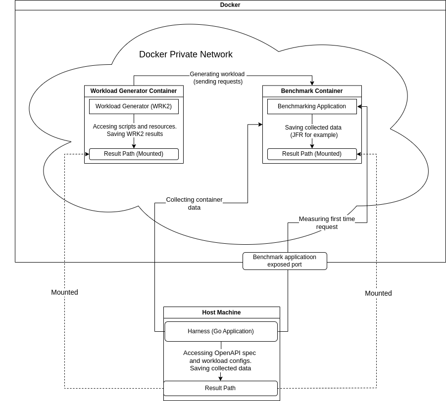
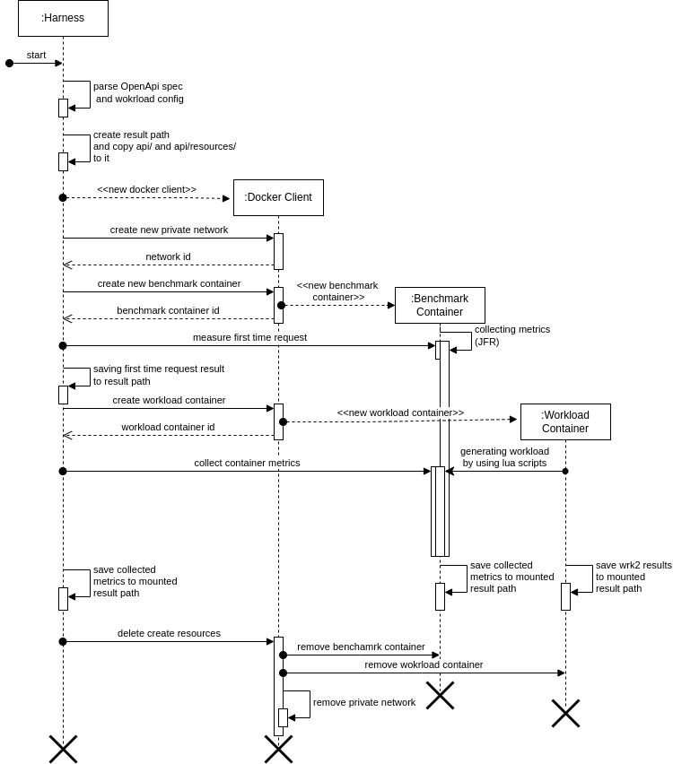

# Architecture and Execution Flow

The Serverless Benchmark Suite is designed to provide a standardized, automated environment for evaluating the performance of serverless and containerized applications. This document outlines the architecture and execution flow of the suite, detailing how the harness, benchmark application, and workload generator interact to produce reliable and reproducible benchmark results.

# System Architecture Diagram

Below is a diagram illustrating the high-level architecture of the harness execution environment:

The diagram `architecture` visually represents relations between the main components of the Serverless Benchmark Suite during a benchmark run:

- **Harness (Host Machine):**  
  The harness is the orchestrator, running outside of Docker. It is responsible 
  for launching and managing the lifecycle of the two main containers: the 
  **Benchmark Application** and the **Workload Generator (WRK2)**. The harness 
  collect container metrics and measures the time to first request via the port exposed by the benchmark application.

- **Benchmark Application Container:**  
  This container runs the application under test, exposing its API on a specified
  port. The benchmark application container is instrumented to allow the harness
  to collect resource usage metrics (CPU, memory, etc.) during the benchmark.

- **Workload Generator (WRK2) Container:**  
  Once the application is ready and the first request is measured succesfully the
  harness launches the WRK2 container. This container generates HTTP requests against
  the benchmark application's API, simulating client workloads as defined by Lua scripts
  and configuration files. The WRK2 container is connected to the same private Docker
  network as the application container, ensuring isolated and direct communication.

- **Private Docker Network:**  
  Both containers are attached to a dedicated Docker network, which isolates
  benchmark traffic and ensures consistent, reproducible results. The network
  allows the WRK2 container to address the application container by its internal hostname.

- **Result Path Mounting:**  
  In addition to the application and workload generator containers, the harness 
  mounts a shared results directory from the host machine into both containers.
  This directory serves as a central location for all benchmark-related files,
  including the OpenAPI specification (`api.yaml`), workload configuration 
  (`config.json`), example resources, and any output or log files generated during the benchmark run.

  The results directory on the host (e.g., `/workspace/benchmark/<benchmark-name>/api`) is mounted to a consistent path inside each container. This allows both the benchmark application and the WRK2 workload generator to access the same set of files and to write output (such as logs, generated data, or result summaries) to a location that the harness can later collect and analyze.

  - In the **Benchmark Application Container**, this mount point provides access to the API specification, configuration, and any input resources needed by the application.
  - In the **Workload Generator (WRK2) Container**, the same mount point is used to read configuration and example files, as well as to write output files (such as WRK2 latency logs or custom Lua script outputs).

  This shared result path ensures that all artifacts produced during the benchmark
  run are easily accessible to the harness for post-processing and reporting, and that both containers operate on a consistent set of input and output files.

## Execution

Below is a sequential diagram illustrating the workflow of the harness:

The `workflow` diagram provides a step-by-step visualization of the benchmark
execution flow orchestrated by the harness. Here is a detailed description of each stage in the workflow:

1. **Harness Initialization:**  
The process begins with the harness initializing the benchmark environment. 
This includes setting up configuration parameters, preparing the results directory,
and ensuring that all required resources (such as the OpenAPI specification and 
workload configuration files) are available.

2. **Private Docker Network Creation:**  
The harness creates a dedicated private Docker network. This network will be used
to connect the benchmark application and workload generator containers, ensuring
isolated and reproducible communication between them.

3. **Benchmark Application Container Launch:**  
The harness starts the benchmark application container, mounting the shared
results directory and connecting it to the private Docker network. The application
container is started with the necessary environment variables and configuration files.

4. **Time to First Request Measurement:**  
Once the application signals readiness, the harness measures the time to first
successful request. This metric is important for evaluating cold start latency
and overall responsiveness of the application under test.

5. **Workload Generator (WRK2) Container Launch:**  
After confirming application readiness and measuring the initial response time,
the harness launches the WRK2 workload generator container. This container is
also connected to the private Docker network and mounts the shared results directory.

5. **Workload Execution:**  
The WRK2 container executes the benchmark workload as defined by the provided 
Lua scripts and configuration files. It generates HTTP requests against the 
benchmark application's API, simulating real-world client traffic patterns.

7. **Metrics and Logs Collection:**  
Throughout the benchmark run, the harness collects resource usage metrics 
(CPU, memory, etc.) from the application container, as well as logs and output 
files from both containers. All artifacts are written to the shared results directory for later analysis.

8. **Workload Completion and Container Teardown:**  
Once the workload execution is complete, the harness stops and removes both the
application and WRK2 containers. It also tears down the private Docker network to
clean up the environment.

1.  **Results Aggregation:**  
Finally, the harness aggregates all collected metrics, logs, and output files in
the result directory.

This execution flow ensures that each benchmark run is isolated, reproducible,
and produces comprehensive results for analysis. The harness automates the entire
lifecycle, from environment setup to results collecting, enabling consistent and
reliable benchmarking of serverless and containerized applications.

### JVM vs. Native Execution Modes

A key feature of the Serverless Benchmark Suite is its ability to benchmark 
applications in both **JVM (Java Virtual Machine)** and **native (AOT-compiled)**
modes. The harness supports both modes by providing separate Docker images and launch
commands for each. During a benchmark run, the harness:
- Selects the appropriate image and entrypoint based on the desired mode (JVM or native).
- Measures key metrics such as startup time, time to first request, throughput,
and resource usage for each mode.
- Ensures that the same workload and configuration are used, enabling fair comparison.

This dual-mode capability allows users to directly compare the trade-offs between
JVM and native execution for serverless and containerized Java workloads, providing
valuable insights into cold start performance, resource efficiency, and steady-state throughput.

